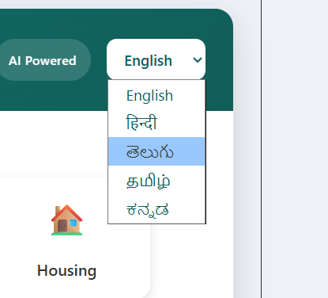

# 🇮🇳 Bharat AI Citizen Assistant

> **An AI-powered multilingual citizen assistant that simplifies access to Indian government services through AI, voice interaction, and regional language support.**

🏆 Built for the **Build in AI for India Hackathon 2026**
<p align="center">


</p>

## 📖 Overview
Bharat AI Citizen Assistant is an AI-powered web application that helps citizens discover government schemes, understand eligibility, prepare documents, and receive step-by-step guidance using natural language and voice interaction.

## 🎯 Problem Statement
- Difficulty finding relevant government schemes
- Complex eligibility rules
- Confusing documentation
- Language barriers
- Limited digital guidance

## 💡 Solution
- AI-powered government assistant
- Multilingual conversations
- Voice input & output
- Government scheme recommendations
- Document checklist
- Step-by-step application guidance
- Provides links to official government resources whenever available.

## ✨ Features
- 🤖 AI Government Assistant
- 🌐 Multilingual Support (English, Hindi, Telugu, Tamil, Kannada, Bengali)
- 🎤 Speech-to-Text (Gnani AI)
- 🔊 Text-to-Speech (Gnani AI)
- 🏛 Government Scheme Recommendations
- 📄 Smart Document Checklist
- 📱 Responsive React UI

## 🏗 Architecture
```text
User
 │
 ▼
React (Vite)
 │
 ▼
FastAPI
 ├── OpenRouter (DeepSeek Chat V3)
 ├── Gnani STT
 ├── Gnani TTS
 └── Government Scheme Dataset
 │
 ▼
AI Response
```

## 🛠 Tech Stack
### Frontend
- React
- Vite
- JavaScript
- Axios

### Backend
- FastAPI
- Python
- Uvicorn

### AI & Voice
- OpenRouter
- DeepSeek Chat V3
- Gnani AI STT
- Gnani AI TTS

## 📂 Project Structure
```text
bharat-ai-citizen-assistant/
├── frontend/
├── backend/
├── Screenshots/
├── README.md
├── LICENSE
└── .gitignore
```

## 🚀 Installation
```bash
git clone https://github.com/varun1132112251/Bharat-AI-Citizen-Assistant.git
cd Bharat-AI-Citizen-Assistant
```

### Frontend
```bash
cd frontend
npm install
npm run dev
```

### Backend
```bash
cd backend
python -m venv venv
venv\Scripts\activate
pip install -r requirements.txt
uvicorn main:app --reload
```

## 🔑 Environment Variables
Create `.env` inside `backend/`

```env
OPENROUTER_API_KEY=your_openrouter_api_key
GNANI_API_KEY=your_gnani_api_key
```

## 📡 API Endpoints

| Endpoint | Description |
|----------|-------------|
| /assistant | AI Assistant |
| /speech-to-text | Voice to Text |
| /text-to-speech | Text to Voice |
| /recommend | Scheme Recommendation |
| /checklist | Document Checklist |

## 📸 Screenshots
### 🏠 Home Page


### 💬 AI Chat


### 🏛 Scheme Recommendation


### 🌐 Multilingual Support



## 🎯 Use Cases
- Farmers
- Students
- Senior Citizens
- Rural Communities
- Government Service Applicants

## 🗺 Future Roadmap
- OCR Document Verification
- DigiLocker Integration
- Aadhaar Integration
- WhatsApp Assistant
- Offline Mode
- Application Tracking
- AI Form Assistance

## 🤝 Contributing
Fork → Create Branch → Commit → Push → Pull Request.

## 👨‍💻 Developer
**Bhupathi Mahesh Varun Kumar**

- B.Tech (CSM)
- ACE Engineering College
- Hyderabad, India

## 📄 License
MIT License.

---
**Empowering every citizen with AI-driven access to government services.**

## ⭐ Support

If you found this project useful,

⭐ Star the repository

🍴 Fork the project

💬 Share your feedback