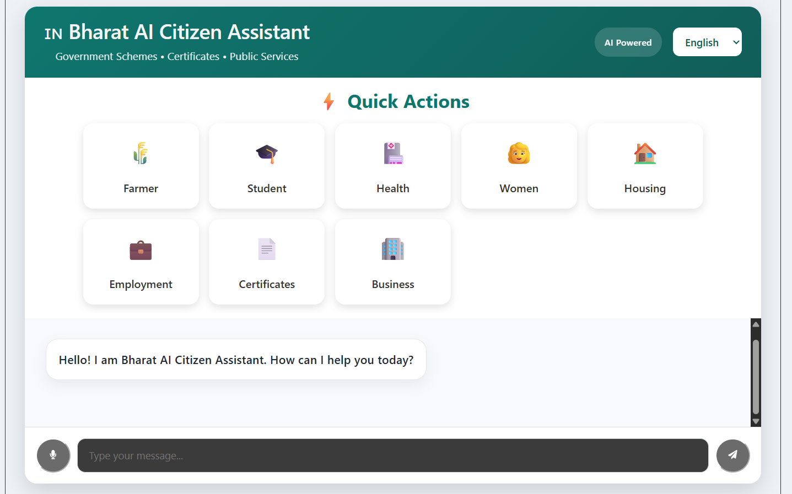
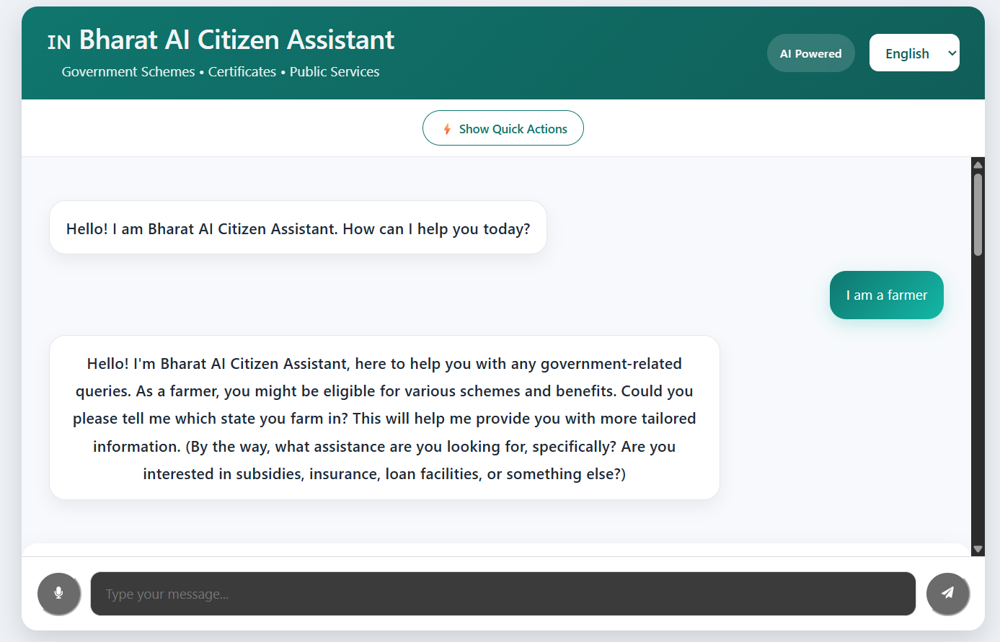
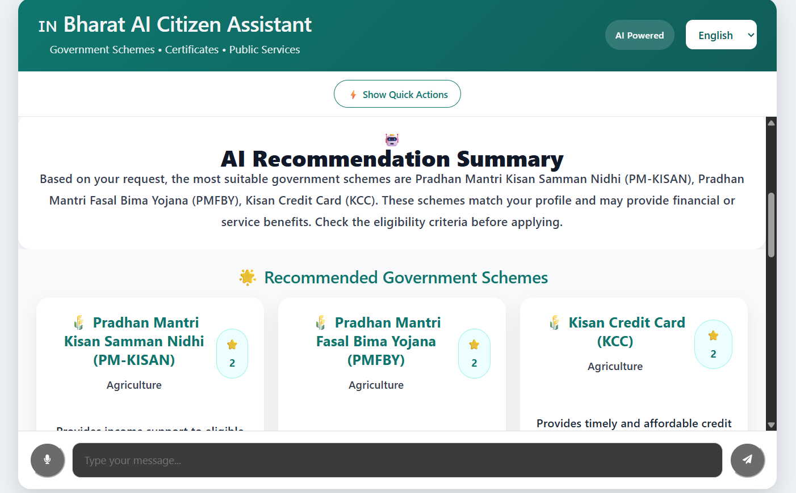

🇮🇳 Bharat AI Citizen Assistant

«An AI-powered digital assistant that simplifies access to Indian government services, schemes, and documentation for every citizen.»

---

📖 Overview

Bharat AI Citizen Assistant is an AI-powered web application designed to bridge the gap between citizens and government services.

Many citizens struggle to understand government schemes, eligibility requirements, required documents, and application procedures. This project provides a conversational AI interface that offers personalized guidance, explains government schemes, generates document checklists, and assists users through every step of the application process.

The goal is to make government services simple, accessible, and available in natural language.

---

🚀 Problem Statement

Citizens often face challenges such as:

- Difficulty finding the right government scheme
- Complex eligibility criteria
- Confusing documentation requirements
- Lack of proper guidance during applications
- Limited awareness of available benefits
- Language barriers while accessing services

---

💡 Solution

Bharat AI Citizen Assistant acts as an intelligent virtual assistant that:

- Understands user queries in natural language
- Recommends suitable government schemes
- Explains eligibility criteria
- Generates personalized document checklists
- Provides step-by-step application guidance
- Supports voice-based interaction
- Makes government information easier to understand

---

✨ Features

🤖 AI Chat Assistant

- Natural language conversation
- Instant responses
- Context-aware assistance

---

🏛 Government Scheme Recommendation

Provides recommendations for schemes such as:

- PM Kisan
- Kisan Credit Card (KCC)
- Crop Insurance
- Soil Health Card
- Other government welfare schemes

---

📄 Smart Document Checklist

Automatically generates:

- Required documents
- Optional documents
- Important notes
- Submission guidance

---

📝 Step-by-Step Guidance

Explains:

- Eligibility
- Registration process
- Required documents
- Application procedure

---

🎤 Voice Input

Users can interact using speech instead of typing.

---

🔊 Voice Output

AI responses can be spoken aloud for improved accessibility.

---

🌐 Multilingual Ready

Designed to support multiple Indian languages including:

- English
- Hindi
- Telugu
- Tamil
- Kannada
- Bengali

---

🎨 Modern User Interface

- Clean layout
- Responsive design
- Recommendation cards
- Summary cards
- User-friendly experience

---

🛠 Tech Stack

Frontend

- React
- Vite
- JavaScript
- HTML5
- CSS3
- Axios

---

Backend

- FastAPI
- Python
- Uvicorn

---

AI

- OpenRouter API
- Gemini 2.5 Flash

---

Development Tools

- VS Code
- Git
- GitHub
- npm

---

📂 Project Structure

bharat-ai-citizen-assistant/

│
├── frontend/
│   ├── src/
│   ├── public/
│   ├── package.json
│   └── vite.config.js
│
├── backend/
│   ├── main.py
│   ├── requirements.txt
│   └── .env
│
├── .gitignore
├── README.md
└── LICENSE

---

⚙️ Installation

1. Clone the repository

git clone https://github.com/your-username/bharat-ai-citizen-assistant.git

---

2. Move into the project

cd bharat-ai-citizen-assistant

---

3. Frontend Setup

cd frontend

npm install

npm run dev

---

4. Backend Setup

Create a virtual environment

python -m venv venv

Activate it

Windows

venv\Scripts\activate

Install dependencies

pip install -r requirements.txt

Run FastAPI

uvicorn main:app --reload

---

5. Environment Variables

Create a ".env" file inside the backend folder.

OPENROUTER_API_KEY=YOUR_API_KEY

---

## 📸 Screenshots

### 🏠 Home Screen

---

### 💬 AI Chat Interface

---

### 🌐 AI Recommendation

---

🎯 Use Cases

- Farmers
- Students
- Senior Citizens
- Job Seekers
- Rural Citizens
- Government Service Applicants
- First-time Users of Government Schemes

---

🔮 Future Enhancements

- OCR-based document verification
- Real-time government portal integration
- Application status tracking
- Aadhaar authentication
- DigiLocker integration
- Nearby government office locator
- AI-powered form auto-fill
- Personalized citizen dashboard
- Mobile application
- Offline support

---

📈 Current Project Status

✅ MVP Completed

Implemented Features:

- AI Chat Assistant
- Government Scheme Recommendation
- Smart Document Checklist
- Voice Input
- Voice Output
- Frontend–Backend Integration
- Responsive UI
- OpenRouter + Gemini Integration

---

🤝 Contributing

Contributions, suggestions, and improvements are welcome.

1. Fork the repository.
2. Create a new branch.
3. Commit your changes.
4. Push the branch.
5. Open a Pull Request.

---

👨‍💻 Developer

Varun

B.Tech CSM Student

ACE Engineering College

Passionate about AI, Machine Learning, and building impactful products for society.

---

📄 License

This project is licensed under the MIT License.

---

⭐ Support

If you found this project helpful:

⭐ Star the repository

🍴 Fork it

💬 Share your feedback

---

«"Empowering every citizen with AI-driven access to government services."»
